# cdk-gof-design-pattern

## Composite

### Composite: 概念

### Composite: CDK

### Composite: 簡略 CDK

## Decorator

### Decorator: 概念

### Decorator: CDK

## Facade

### Facade: 概念

### Facade: CDK

## Adapter

### Adapter: 概念

### Adapter: CDK

