# cdk-gof-design-pattern

## Composite

### Composite: 概念


### Composite: CDK


### Composite: 簡略 CDK

## Decorator

### Decorator: 概念


### Decorator: CDK


## Facade

### Facade: 概念


### Facade: CDK


## Adapter

### Adapter: 概念


### Adapter: CDK


## Template Method

### Template Method: 概念


### Template Method: CDK


## Singleton

### Singleton: 概念

### Singleton: CDK


## Visitor

### Visitor: 概念


### Visitor: CDK


### Visitor: 簡略 CDK

