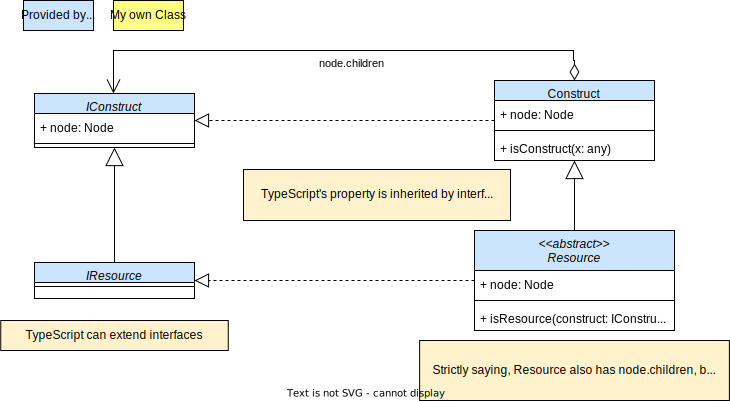

# cdk-gof-design-pattern

## Composite

### Composite: 概念

### Composite: CDK

### Composite: 簡略 CDK

## Facade

### Facade: 概念

### Facade: CDK

## Adapter

### Adapter: 概念

### Adapter: CDK

## Singleton

### Singleton: 概念

### Singleton: CDK

## Strategy

### Strategy: 概念

### Strategy: CDK

### Strategy: 簡略 CDK

## Template Method

### Template Method: 概念

### Template Method: CDK

## Factory Method

### Factory Method: 概念

### Factory Method: CDK

## Decorator

### Decorator: 概念

### Decorator: CDK

## Visitor

### Visitor: 概念

### Visitor: CDK

### Visitor: 簡略 CDK

