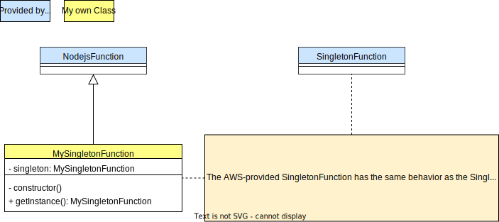

# cdk-gof-design-pattern

This repository is about **AWS CDK with Gof Design patterns**, including class diagrams and CDK code.

The following in Japanese, [Japanese README](./ja/README.md).

## Composite

### Composite: Concept

### Composite: CDK

### Composite: Simplified CDK

## Facade

### Facade: Concept

### Facade: CDK

## Adapter

### Adapter: Concept

### Adapter: CDK

## Decorator

### Decorator: Concept

### Decorator: CDK

### Decorator: Simplified CDK

## Singleton

### Singleton: Concept

### Singleton: CDK

## Strategy

### Strategy: Concept

### Strategy: CDK

### Strategy: Simplified CDK

## Template Method

### Template Method: Concept

### Template Method: CDK

## Factory Method

### Factory Method: Concept

### Factory Method: CDK

## Abstract Factory

### Abstract Factory: Concept

### Abstract Factory: CDK

### Abstract Factory: Simplified CDK

## Visitor

### Visitor: Concept

### Visitor: CDK

### Visitor: Simplified CDK

